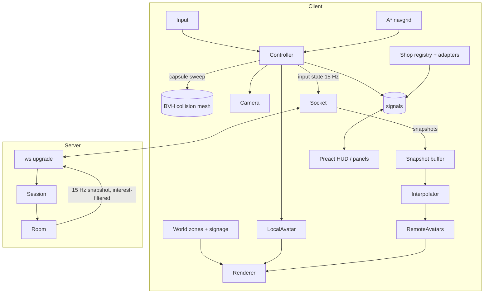

# Architecture

## Stack

| Concern | Choice | Why (details in ADRs) |
|---|---|---|
| Language | TypeScript (strict) | One language for client, server and protocol |
| Build | Vite | Fast dev server, content-hashed output, simple config |
| 3D | **Three.js** (`WebGLRenderer`; `WebGPURenderer` behind a flag) | The best-known web 3D library. Contributors already know it. Tree-shakeable. [ADR 0001](adr/0001-threejs-over-custom-engine.md) |
| UI overlay | **Preact + @preact/signals** (~5 KB gz) | Components for panels and dialogs without React's size. The game loop never goes through the UI framework. [ADR 0002](adr/0002-preact-ui-outside-render-loop.md) |
| Collision | **three-mesh-bvh** capsule vs. a simplified collision mesh | Handles stairs, ramps and escalators with no physics engine |
| Pathfinding | A* on a baked walkable grid (0.25 m cells) | ~100 lines, no WASM. Enough for a mall |
| Assets | glTF + **Meshopt** + **KTX2 (Basis)**, processed by `gltf-transform` | Smallest downloads with fast decoders |
| Server | **Node 22 / Bun** + `ws`, one process, rooms in memory | Anyone can self-host with Docker. [ADR 0003](adr/0003-websocket-server-binary-protocol.md) |
| Protocol | Hand-packed binary over WebSocket (`DataView`), JSON for rare messages | ~14 bytes per player per tick |
| Tests | Vitest (unit), Playwright (e2e + perf smoke) | |
| Lint/format | Biome | One fast tool |

## Repo layout

```
plaza/
├─ plaza.config.ts          # ← the file operators edit
├─ content/                 # shop logos, product JSON, i18n strings
├─ assets-src/              # .blend files and raw Higgsfield exports (Git LFS)
├─ client/
│  ├─ index.html
│  └─ src/
│     ├─ main.ts            # boot: probe → load → start loop
│     ├─ loop.ts            # fixed-step update + render, the only rAF
│     ├─ render/            # renderer, quality tiers, post, lightmaps
│     ├─ world/             # load mall glTF, zones, streaming, signage
│     ├─ player/            # input, controller, camera, collision, nav
│     ├─ avatars/           # avatar factory, animation, LOD, name tags
│     ├─ net/               # socket, codec, snapshot buffer, interpolation
│     ├─ shops/             # shop registry, product adapters, panel data
│     ├─ ui/                # Preact components (HUD, panels, dialogs)
│     └─ state.ts           # signals shared by game and UI
├─ server/
│  └─ src/
│     ├─ index.ts           # http + ws upgrade, health, config
│     ├─ room.ts            # tick, interest, broadcast
│     ├─ session.ts         # join, resume, rate limits
│     └─ moderation.ts      # name/chat filters, mute, kick
├─ shared/
│  ├─ protocol.ts           # message ids, binary layouts, encode/decode
│  ├─ config.ts             # config schema (zod) + types
│  └─ constants.ts          # tick rate, world bounds, speeds
└─ tools/
   ├─ optimize-assets.ts    # gltf-transform pipeline
   ├─ bake-navgrid.ts       # collision mesh → walkable grid
   └─ perf-smoke.ts         # Playwright perf budget check
```

Rule: **no file over ~300 lines.** When a file grows past that, split it by responsibility.

## Runtime overview



### Frame loop (`loop.ts`)
```
accumulate dt
while acc >= 1/60: controller.step(1/60); acc -= 1/60   // fixed-step movement
net.sampleInput()                                          // every 4th step → 15 Hz
interp.update(now - 100ms)                                 // remote players
avatars.update(dt)                                         // mixers, LOD, tags (culled ones skipped)
camera.update(dt)
renderer.render()
```
There's only one `requestAnimationFrame`, and nothing allocates inside the loop. Reuse vectors from a module-level scratch pool.

### Game ↔ UI boundary
The game writes a handful of signals (`zone`, `nearbyShop`, `online`, `chat`, `panel`). The UI reads them. The UI sends back **commands** (`travelTo(id)`, `openPanel(id)`, `sendChat(text)`). UI components never touch Three.js objects, and game code never touches the DOM, except for the canvas.

## World

- The mall is **one Blender file** with collections `visual`, `collision`, `zones`, `spawns`, `slots`, `seats`, `escalators`. The exporter writes:
  - `mall.glb`: visual meshes with a lightmap UV (`uv1`) and KTX2 lightmaps, split into **zone chunks** (`atrium`, `west-1`, …).
  - `mall.collision.glb`: low-poly collision mesh (≤ 5k tris).
  - `mall.meta.json`: zones (AABBs + names), shop slots (door pose, sign rectangle, window rectangle), seats, spawn points and escalator paths. It's baked from Blender empties.
- **Streaming:** the atrium + concourse chunk loads first (it's the first playable frame). Shop interiors load when the player comes within 25 m, or when their panel opens. They unload when more than 60 m away and older than LRU size 6.
- **Shop slots:** `plaza.config.ts` maps `shopId → slotId`. Each slot defines where the sign, window and door go, so shops move around without touching Blender.
- **Signage:** generated on an `OffscreenCanvas` in a worker from config (text, colours, logo), then uploaded as a texture. It's cached in IndexedDB by content hash. The reference already proves this works with complex scripts.

## Avatars

- **One skeleton** (Mixamo-compatible naming) shared by every body and outfit.
- **One animation pack** `anims.glb` (~150 KB): idle, walk, run, jump, fall, land, sit-bench, sit-floor, wave, dance, hug, throw, react. `AnimationMixer` crossfades between them based on speed and state.
- An outfit is a **skinned mesh per body type** with one 1K KTX2 atlas. Hats and glasses are small rigid meshes parented to the `Head` bone.
- **LOD:**

  | Distance | Representation |
  |---|---|
  | < 12 m | full mesh (~15k tris), full animation |
  | 12–35 m | LOD1 (~3k tris), animation updated every other frame |
  | > 35 m or off-screen | LOD2 (~600 tris), animation frozen or at 10 Hz |
  | beyond the 40 closest | hidden. Name tag shown only on the minimap |

- Name tags are **one shared `InstancedMesh` of quads** sampling a name atlas. They don't create one DOM node per player.

## Networking

### Model
The **client is authoritative for its own movement**, and the **server validates** it (max speed, world bounds, teleport only via an allowed `travel` message). There's no combat, so we don't need full server authority. This keeps both client and server simple.

### Connection lifecycle
```mermaid
sequenceDiagram
  participant C as Client
  participant S as Server
  C->>S: GET /ws?room=main (upgrade)
  C->>S: JOIN {name, look, resumeToken?}
  S-->>C: WELCOME {selfId, resumeToken, tick, roster[]}
  loop 15 Hz
    C->>S: INPUT (binary: pos, yaw, anim)
    S-->>C: SNAPSHOT (binary: all players in interest set)
  end
  C->>S: CHAT / EMOTE / ACT (JSON, rate-limited)
  S-->>C: EVENT (JSON: chat, emote, join/leave batched every 2 s)
  Note over C,S: socket drops → client retries with backoff (0.5, 1, 2, 4 s…) and resumeToken; the server keeps the seat for 30 s, so there's no join/leave spam
```

### Binary layouts (little-endian)
**INPUT** (client → server), 12 bytes:
| field | type | notes |
|---|---|---|
| msg | u8 | `0x01` |
| seq | u8 | wraps |
| x, z | i16 ×2 | centimetres → ±327 m, 1 cm precision (the mall fits in 300 m) |
| y | i16 | centimetres |
| yaw | u8 | 256 steps |
| anim | u8 | state (4 bits) + speed bucket (4 bits), inspired by the reference's packed int |
| flags | u8 | sitting, air, emote-active… |
| pad | u8 | |

**SNAPSHOT** (server → client): header `u8 msg, u16 tick, u8 count`, then per player `u16 id + the 9-byte body above` = **11 bytes/player**. 40 visible players × 15 Hz ≈ **6.6 KB/s** down per client.

### Interest management
Players are bucketed by zone. A client receives players in its own zone and neighbouring zones, up to 40 (nearest first). Chat is global. Emotes are sent to the interest set only.

### Interpolation
The client keeps a snapshot ring buffer and renders remote players at `serverTime − 100 ms`. It lerps position and slerps yaw. If a packet is late it extrapolates for up to 250 ms, then holds.

### Server limits
- A room holds up to 100 players. When `main` is full, the server creates `main-2` automatically.
- Chat: 1 message per 1.5 s, 200 characters max, a word filter, and HTML escaped on render. There's never an `innerHTML` with user text.
- Names: 2–20 characters, normalised to Unicode NFC, with the filter applied.
- Host: `HOST_SECRET` env var → `POST /host-token` → a signed JWT valid for 12 h, kept in memory (not `localStorage`).

## Shops & products

```ts
// shared/config.ts (abridged)
type Shop = {
  id: string; slot: string; name: string; tagline?: string;
  colors: { bg: string; accent: string }; logo?: string;
  description?: string; features?: string[];
  links: { label: string; url: string }[];
  products?: { adapter: 'static' | 'shopify' | 'json-url'; options: Record<string, unknown> };
};
```
An adapter is a single function, `(options, locale) => Promise<Product[]>`. Results are cached in memory for 5 minutes and in IndexedDB for offline use. If an adapter fails, the panel says so ("Products unavailable, open the store"). It never quietly shows demo data.

## Analytics

`track(event, props)` goes to a pluggable sink: none by default, with a beacon-to-URL option. Events: `enter`, `zone_enter`, `shop_panel_open`, `product_click`, `outbound_click`, `chat_sent` (count only), `quality_tier`. No personal data and no cookies.

## Quality tiers

| | Low | Medium | High |
|---|---|---|---|
| Pixel ratio | min(DPR, 1) | min(DPR, 1.5) | min(DPR, 2) |
| Lightmaps | 1K | 2K | 2K |
| Floor reflection | env-map only | env-map + fake blur | planar reflection (half-res) |
| Shadows | blob decals | blob decals | 1 soft shadow map for avatars |
| Post | none | FXAA | SMAA + subtle bloom on signs |
| Visible avatars (full LOD) | 8 | 16 | 24 |

**Auto** starts at Medium, samples frame time for 3 s after spawning, then steps down if p90 frame time is above 20 ms or up if it's below 10 ms. The choice is saved.

## Deployment

- **Static-only:** `pnpm build` produces `dist/`, which can be hosted on any CDN (GitHub Pages, Netlify, Vercel, Cloudflare Pages). Single-player only.
- **Multiplayer:** the same `dist/` plus `docker run plaza-server` (or `bun server/src/index.ts`). Set `VITE_PLAZA_WS=wss://…` at build time.
- Asset caching: hashed files get `Cache-Control: public, max-age=31536000, immutable`. `index.html` gets `no-cache`.
