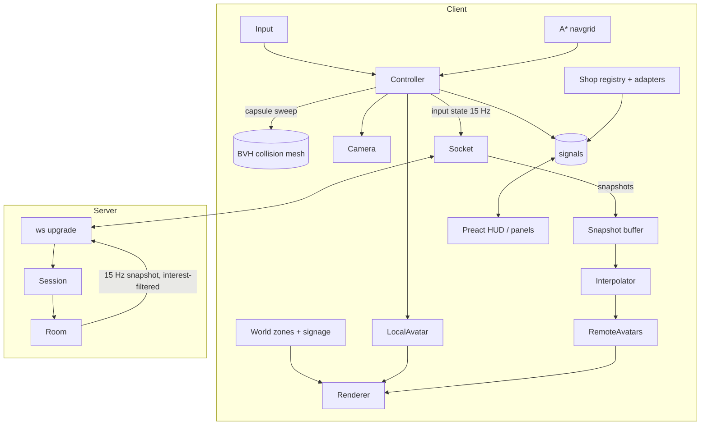

# Architecture

## Stack

| Concern | Choice | Why (details in ADRs) |
|---|---|---|
| Language | TypeScript (strict) | One language for client, server and protocol |
| Build | Vite | Fast dev server, content-hashed output, simple config |
| 3D | **Three.js** (`WebGLRenderer`; `WebGPURenderer` behind a flag) | The best-known web 3D library. Contributors already know it. Tree-shakeable. [ADR 0001](adr/0001-threejs-over-custom-engine.md) |
| UI overlay | **Preact + @preact/signals** (~5 KB gz) | Components for panels and dialogs without React's size. The game loop never goes through the UI framework. [ADR 0002](adr/0002-preact-ui-outside-render-loop.md) |
| Collision | **three-mesh-bvh** capsule vs. a simplified collision mesh | Handles stairs, ramps and escalators with no physics engine |
| Pathfinding | A* on a baked walkable grid (0.25 m cells) | A few hundred lines and no WASM, which is plenty for a mall |
| Assets | glTF + **Meshopt** + **KTX2 (Basis)**, processed by `gltf-transform` | Smallest downloads with fast decoders |
| Server | **Node 24** + `ws`, one process, rooms in memory, TypeScript run directly (no build step) | Anyone can self-host with Docker. [ADR 0003](adr/0003-websocket-server-binary-protocol.md) |
| Protocol | Hand-packed binary over WebSocket (`DataView`), JSON for rare messages | ~14 bytes per player per tick |
| Tests | Vitest (unit), Playwright (e2e + perf smoke) | |
| Lint/format | Biome | One fast tool for both |

## Repo layout

```
shopping-mall/
├─ mall.config.ts          # shops and products for a static mall, and the seed for a live one
├─ assets-src/             # source art: CC0 kits, Higgsfield models, textures and audio, with licences
├─ client/
│  ├─ index.html
│  ├─ admin/index.html      # the admin page
│  └─ src/
│     ├─ main.ts            # boot: load the mall, wire everything up, start the loop
│     ├─ loop.ts            # fixed-step update + render, the only rAF
│     ├─ render/            # renderer, quality tiers, environment, floor mirror, remote players
│     ├─ world/             # the mall, zones, props, shop interiors, escalators, apples, shoppers
│     ├─ player/            # input, controller, camera, raycasts, navigation, seats, overview
│     ├─ avatars/           # the avatar kit: characters, clips, sitting and holding
│     ├─ net/               # socket, snapshots, interpolation, multiplayer wiring
│     ├─ shops/             # storefronts, signs, product adapters
│     ├─ ui/                # Preact components (HUD, dock, dialogs, panels)
│     ├─ admin/             # the admin page's components
│     ├─ i18n/              # English and Burmese strings
│     └─ state.ts           # signals shared by game and UI
├─ server/
│  └─ src/
│     ├─ main.ts            # entry: settings from the environment, metrics
│     ├─ server.ts          # http (health, host sign-in) + ws: join, resume, rooms, messages
│     ├─ room.ts            # tick, nearest-40 interest, broadcast, batched presence
│     ├─ movement.ts        # speed and bounds checks
│     ├─ moderation.ts      # blocklist, reports
│     ├─ host.ts            # host tokens
│     ├─ http/, db/         # content API, uploads, Postgres migrations and queries
│     └─ art.ts, assets.ts  # the mall package and uploaded files
├─ shared/src/
│  ├─ protocol.ts           # message types, binary layouts, encode/decode
│  ├─ config.ts, meta.ts    # config and mall meta schemas (zod) + types
│  ├─ navgrid.ts, bake.ts   # the walkable grid, and baking it from a collision mesh
│  └─ constants.ts          # tick rate, speeds, camera
└─ tools/
   ├─ greybox/              # the mall's layout, as code
   ├─ blender/              # the Blender build and bake, and the character rigging
   ├─ assets/               # avatar, props and audio packs
   ├─ bake-navgrid.ts       # collision mesh → walkable grid
   └─ perf.ts, a11y.ts      # Playwright budget and accessibility checks
```

The rule is **no file over about 300 lines**. When one grows past that, split it by what each part does.

## Runtime overview



### Frame loop (`loop.ts`)
```
accumulate dt
while acc >= 1/60: controller.step(1/60); acc -= 1/60   // fixed-step movement
net.sampleInput()                                          // every 4th step → 15 Hz
interp.update(now - 100ms)                                 // remote players
avatars.update(dt)                                         // mixers, LOD, tags (culled ones skipped)
camera.update(dt)
renderer.render()
```
There's only one `requestAnimationFrame`, and nothing allocates inside the loop: code reuses scratch vectors kept at module level.

### Game ↔ UI boundary
The game writes a handful of signals (`zone`, `nearbyShop`, `online`, `chat`, `panel`) and the UI reads them. The UI sends back **commands** (`travelTo(id)`, `openPanel(id)`, `sendChat(text)`). UI components never touch Three.js objects, and game code never touches the DOM apart from the canvas.

## World

- The mall's layout is code: `tools/greybox/` describes the building, and `pnpm greybox` writes three files:
  - `greybox.collision.glb`: the low-poly collision mesh people stand on and bump into.
  - `mall.meta.json`: floors, zones (boxes with names), shop units (door, sign and interior), seats, spawn points, escalators and where the props go.
  - `navgrid.bin`: the walkable grid for pathfinding, baked from the collision mesh.
- `pnpm mall` then dresses that layout in Blender and bakes its lighting into `mall.glb`, which is what visitors see. [Art direction](art-direction.md#the-built-in-mall-blender-issue-2) has the steps. A host can also upload a whole building of their own from the admin page.
- **Props** come in packs by area and load nearest first, after the building. Shop interiors come from the same packs and follow each shop's category.
- **Shop units:** each shop names its unit, and the unit says where its sign, door and interior are, so shops move around without anyone touching Blender.
- **Signage** is painted on a canvas from config (text, colours, logo) while the world loads, about 3 ms per sign, then uploaded as a texture. Fonts for other scripts, such as Burmese, load only when a sign needs them.

## Avatars

- **One rig.** Every character uses Kenney's 7-bone rig (root, torso, head, two arms, two legs), including the generated ones, which `pnpm rig` fits onto it.
- **One set of clips** in `avatars.glb`: idle, walk, sprint, jump, fall, sit, three emotes, dance, hug and throw. `AnimationMixer` crossfades between them by speed and state, and gestures (a wave, picking or throwing an apple) play over the top.
- **Each character is measured once** when it's created: how deep its body is and how low its seat is, so it sits back against a backrest at the right height, and where its right hand is, so an apple sits in it at a size that suits the hand.
- Remote players nearer than the quality tier's distance (12, 20 or 30 m) animate every frame, and those further away every third frame. The server only sends the 40 nearest.
- Name tags are **one instanced billboard mesh** that samples a name atlas; atlas cells go only to people in view and get reused. Speech bubbles and emotes are a small DOM overlay instead, since there are few of them, they don't last, and the browser handles wrapping and emoji.

## Networking

### Model
**Each client decides its own movement**, and the **server checks** it: top speed, the world's bounds, and teleports only through an allowed `travel` message. There's no combat, so the server doesn't need full authority, and both sides stay simple.

### Connection lifecycle
```mermaid
sequenceDiagram
  participant C as Client
  participant S as Server
  C->>S: GET /ws?room=main (upgrade)
  C->>S: JOIN {name, look, resumeToken?}
  S-->>C: WELCOME {selfId, resumeToken, tick, roster[]}
  loop 15 Hz
    C->>S: INPUT (binary: pos, yaw, anim)
    S-->>C: SNAPSHOT (binary: all players in interest set)
  end
  C->>S: CHAT / EMOTE / ACT (JSON, rate-limited)
  S-->>C: EVENT (JSON: chat, emote, join/leave batched every 2 s)
  Note over C,S: socket drops → client retries with backoff (0.5, 1, 2, 4 s…) and resumeToken; the server keeps the seat for 30 s, so there's no join/leave spam
```

### Binary layouts (little-endian)
**INPUT** (client → server), 12 bytes:
| field | type | notes |
|---|---|---|
| msg | u8 | `0x01` |
| seq | u8 | wraps |
| x, z | i16 ×2 | centimetres → ±327 m, 1 cm precision (the mall fits in 300 m) |
| y | i16 | centimetres |
| yaw | u8 | 256 steps |
| anim | u8 | state (4 bits) + speed bucket (4 bits), packed into one byte |
| flags | u8 | sitting, air, emote-active… |
| pad | u8 | |

**SNAPSHOT** (server → client): header `u8 msg, u16 tick, u8 count`, then per player `u16 id + the 9-byte body above` = **11 bytes/player**. 40 visible players × 15 Hz ≈ **6.6 KB/s** down per client.

### Interest management
Players are grouped by zone. A client hears about the players in its own zone and the zones next to it, up to 40, nearest first. Chat goes to everyone in the room, and emotes only to those nearby.

### Interpolation
The client keeps the last few snapshots in a ring buffer and draws remote players 100 ms behind the server's time, interpolating their position and turning. If a packet is late, it carries on the motion for up to 250 ms and then holds still.

### Server limits
- A room holds up to 100 players. Newcomers go to the busiest room in the family (`main`, `main-2` and so on) that still has space, and a new room opens only when they're all full.
- Chat: one message every 1.5 s, 200 characters at most, a word filter, and HTML escaped when shown. User text never goes into `innerHTML`.
- Names: 2 to 20 characters, normalised to Unicode NFC, and filtered.
- Host: `HOST_SECRET` env var → `POST /host-token` → a signed JWT valid for 12 h, kept in memory (not `localStorage`).

## Shops & products

```ts
// shared/config.ts (abridged)
type Shop = {
  id: string; slot: string; name: string; tagline?: string;
  colors: { bg: string; accent: string }; logo?: string;
  description?: string; features?: string[];
  links: { label: string; url: string }[];
  products?: { adapter: 'static' | 'shopify' | 'json-url'; options: Record<string, unknown> };
};
```
An adapter is a single function, `(options, locale) => Promise<Product[]>`. Results are cached in memory for 5 minutes and in IndexedDB for offline use. If an adapter fails, the panel says so ("Products unavailable, open the store") rather than quietly showing demo data.

## Analytics

`track(event, props)` sends a few anonymous events to the mall's own server, which logs them. There's no personal data and there are no cookies. [Privacy](privacy.md) lists the events and how to switch them off.

## Quality tiers

| | Low | Medium | High |
|---|---|---|---|
| Pixel ratio | min(DPR, 1) | min(DPR, 1.5) | min(DPR, 2) |
| Lightmaps | 1K | 2K | 2K |
| Floor reflection | env-map only | env-map + fake blur | planar reflection (half-res) |
| Shadows | blob decals | blob decals | 1 soft shadow map for avatars |
| Post | none | FXAA | SMAA + subtle bloom on signs |
| Visible avatars (full LOD) | 8 | 16 | 24 |
| Full-rate avatar animation within | 12 m | 20 m | 30 m |
| Ambient shoppers | 3 | 6 | 8 |

*(So far `client/src/quality.ts` sets the pixel ratio, the animation distance, the shoppers and the planar reflection. The rest will come with the features they tune.)*

**Auto** starts at Medium and watches frame time for 3 s after you spawn. It steps down if the p90 frame time is over 20 ms, or up if it's under 10 ms, and remembers the result.

## Deployment

- **Static only:** `pnpm build` produces `dist/`, which any CDN can host (GitHub Pages, Netlify, Vercel, Cloudflare Pages). It's single-player.
- **Multiplayer:** the same `dist/`, plus the server in Docker ([deploying](deploy.md)). If the server lives somewhere else, set `VITE_MALL_WS=wss://…` at build time.
- Asset caching: hashed files get `Cache-Control: public, max-age=31536000, immutable`. `index.html` gets `no-cache`.
