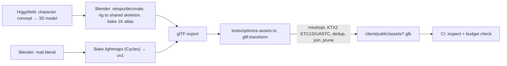

# Art direction and asset pipeline

## Look

**"Evening at a boutique mall."** Warm, calm and a little upmarket, not an arcade.

- **Architecture:** pale travertine floor, warm-white walls, thin brass trim, glass storefronts with slim black mullions, and a double-height atrium under a skylight. Subtle normal maps, some variation in roughness and real light keep it from looking flat.
- **Light:** baked global illumination. Warm 3000 K downlights in the shops, cooler daylight from the skylight, and soft contact shadows under benches and planters. Signs have glowing strips, with a little bloom on High.
- **Reflections:** the polished floor reflects a prefiltered environment map baked from inside the atrium. On High, it's a real planar reflection too.
- **Colour:** each shop brings its own `bg` and `accent`. The building stays neutral so the shops stand out.
- **Characters:** stylised, and every body shares one skeleton. [A plan for realistic characters](plans/realistic-characters.md) is on the roadmap.
- **Motion:** an eased camera, fountain water, clouds drifting over the skylight, and a few shoppers wandering about (3, 6 or 8 depending on the quality setting) so the mall never feels empty.

## UI

The overlay sits on a busy 3D scene, so it has to be easy to read and stay out of the way.

| Token | Value |
|---|---|
| `--ink` | `#F6F1E7` |
| `--muted` | `#B9B2A5` |
| `--accent` | `#E2B857` (operators can change it) |
| `--glass` | `rgba(18,17,15,.62)` + `backdrop-filter: blur(14px)` (a solid colour on Low) |
| `--radius` | 999px pills, 20px sheets |
| Font | **Outfit** (variable), plus a Noto font for other scripts, loaded per language |

- The dock sits at the bottom centre, with icons and labels on desktop and icons only on phones. Sheets slide in from the right on desktop and up from the bottom on phones.
- The UI respects safe-area insets, and **nothing covers the middle 40 % of the screen**, where you're looking.
- On touch screens, everything you can tap is at least 44×44 px.
- v1 is dark only; the 3D scene sets the mood.

## Asset pipeline



### Sources
v1 uses **free CC0 kits** (Kenney, Quaternius, Poly Pizza), with each asset's licence recorded in `assets-src/**/LICENSE`. Higgsfield-generated assets replace them over time through the asset library (ADR 0006). We checked Higgsfield's licence: generated models may be committed.

### Characters
There are 15 characters. Twelve are Kenney's **Mini Characters** (CC0), in `assets-src/avatars/kenney-mini-characters/`. Three were generated with Higgsfield and put on the same rig (`assets-src/avatars/higgsfield/`): a woman in a htamein with thanaka on her cheeks, a man in a longyi, and a student in school uniform. `pnpm assets` builds `client/public/assets/avatars/`:

- **`avatars.glb`** (about 320 KB, loaded after the world) holds every character as one skinned mesh, with body and head joined so each is one draw call. The Kenney characters share one 8 KB texture, and each generated one has a 256 px WebP. The file carries **one** copy of the animation clips, which play on every character because they all use Kenney's 7-bone rig. Characters are scaled to 1.55 m and Meshopt-compressed.
- **`<id>.png`** is the 64 px portrait in the character picker.

The clips are `idle walk sprint jump fall sit emote-yes emote-no interact-right dance hug throw` (`CLIPS` in `shared/src/avatars.ts`). Kenney's pack supplies most of them. Sit, dance, hug and throw are keyframed at build time in `tools/assets/social-clips.ts`. The source pack also has wheelchair clips, wheelchairs, walking aids and glasses, which would be a good next addition.

Each character is measured once when it's created, because they're built very differently: how deep the body is and how low the seat of it sits (for sitting on benches and sofas), and where the right hand is (for holding an apple). So sitting and holding look right on every character.

**Generated characters** go on Kenney's rig with `pnpm rig` (`tools/blender/rig.py`, which needs Blender), so they can play every clip:
1. Generate a chibi figure like Kenney's: big head, arms out to the sides, standing. The prompts are in `assets-src/avatars/higgsfield/prompts.md`. Save it as `assets-src/avatars/higgsfield/<id>.glb`.
2. Add it to `GENERATED` in `tools/blender/rig.ts` with the turn that makes it face +Z, and run `pnpm rig <id>`. The script finds the neck, shoulders and hips in the mesh, raises the arms into Kenney's T-pose, moves the joints to fit, weights each part rigidly to its bone the way Kenney's are, and writes `rigged/<id>.glb` and a preview. The clips only rotate bones, so the moved joints don't upset them.
3. Add its id to `AVATARS` in `shared/src/avatars.ts` (the server only accepts listed ids), run `pnpm assets` and commit the output. `tools/test/avatars.test.ts` checks it.

A character that comes with its own rig and clips would need its own clip set in the avatar kit.

### World
- Units are metres. The concourse is 20 m wide with a 12 m atrium, and the floors are 8 m apart, so a crowd has room.
- Modular kit: storefront (3 widths), column, railing, bench, planter, light fitting, escalator. Repeated pieces export as instances.
- The lightmap UV is on `uv1`, at 32 px/m on the concourse and 16 px/m upstairs.
- Empties named `slot.<id>`, `seat.<id>`, `spawn.<id>`, `zone.<name>` (scaled to its box) and `esc.<id>.start|end` mark the gameplay spots. `tools/export-meta.py` writes them to `mall.meta.json`.

### Replacing the building (mall package)
You can swap the building without a deploy: **admin → Building** takes three files, and the server does the rest.

| File | What it is |
|---|---|
| Visual model `.glb` | What visitors see. Plain glTF 2.0 for now (Meshopt and KTX2 come with `optimize-assets.ts`). Up to 25 MB. |
| Collision model `.glb` | Simple, uncompressed triangles that people stand on and bump into. Every mesh in the scene counts, with its node transforms. Up to 5 MB. |
| `mall.meta.json` | Floors, spawns, shop units, seats, zones and escalators, in the format of `shared/src/meta.ts`. |

On upload the server checks these in order, and if one fails it refuses the package and says why:
1. The meta matches the schema. Errors name the field, for example `meta.slots.3.door.yaw`.
2. Every current shop's unit exists in the new meta. If not, move or delete those shops first.
3. The visual model is a valid `.glb`.
4. The navgrid bakes: the collision model isn't absurdly large, every spawn is on walkable floor, and every escalator starts and ends on walkable floor.

The baked navgrid becomes the package's fourth file, and visitors get the new building on their next visit. You can't delete files that are in use, and **Use the built-in building** switches back. The greybox in `client/public/assets/mall/` is a valid package too: `pnpm greybox` rebuilds it and `pnpm navgrid` bakes it with the same code the server runs (`shared/src/bake.ts`).

### The built-in mall (Blender, issue #2)
`pnpm mall` rebuilds `client/public/assets/mall/mall.glb` in about 2.5 minutes. It needs Blender 4.2 or later; set `BLENDER` if Blender isn't in `/Applications`. `tools/blender/build.py` runs headless and:
1. **Imports the greybox**, so the dimensions, the collision (`greybox.collision.glb`), the meta and the navgrid all stay the greybox's. To change the layout, edit `tools/greybox/` and run `pnpm greybox`, then `pnpm mall`.
2. **Removes faces nobody can see:** the outside of the building, and faces covered all over by other geometry.
3. **Upgrades the materials** with tiling detail textures (60 cm limestone floor tiles, plaster, oak shop floors and a grid of ceiling tiles), laid on UV0 by projecting from world space. The floor, wall and shop-floor patterns come from generated photos in `assets-src/mall/textures/` (its README explains). The build keeps only their brightness, normalised, and multiplies it by the material's colour, so the palette stays in `LOOK`. Without a photo, the script draws a pattern instead; the ceiling uses one.
4. **Adds detail and lights:** dark bronze door frames, stone skirting, a cornice under each ceiling, solid stone parapets with brass handrails round the atrium, and escalators with stainless skirts, glass balustrades and black handrails that curve round at each end. The escalator steps move, so the client draws those. Then ceiling light panels (glowing, with area lights), a warm light in every shop, the flagship and the lobby, and cool daylight through the skylight. Everything bakes as non-metallic: metal has no diffuse light, so it would bake black, and baked surfaces render unlit anyway.
5. **Bakes** direct and indirect diffuse light (without colour) into one 4096² lightmap on UV1, with Cycles on the GPU at 512 samples and OpenImageDenoise, then exports the model. `--exposure` is the single brightness setting (0.14 by default).

`tools/assets/mall.ts` then embeds the lightmap as WebP. The in-between files live in `.cache/mall/` and aren't committed.

**The lightmap convention**, which uploaded buildings follow too: a material with a lightmap has it as its `occlusionTexture` on `TEXCOORD_1`, plus `extras: { lightmap: <scale> }`. The texture stores `sRGB(L / scale)`. The client draws those surfaces unlit, as base colour × L (`MeshBasicMaterial` with `lightMap`), so they look like the Cycles bake at the lowest possible shader cost. Other glTF viewers just see ambient occlusion. Glowing and see-through materials (`lightpanel`, `skylight`, `glass`) don't get a lightmap. `extras.reflect` on the floor adds a faint environment reflection on Medium and High.

### Props
Furniture and decoration come in **props packs** by area, `client/public/assets/props/<pack>.glb`, which `pnpm assets` builds from `assets-src/props/`:

| Kind | Source |
|---|---|
| `bench`, `fountain`, `tree`, `kiosk`, `welcome`, `palm`, `lanterns`, `recycling`, `island`, `coffee-bar`, `bookshelf`, `sneakers`, `plant-stand`, `arcade`, `stall`, `vanity`, `urinal`, `restroom-sign` | Generated with Higgsfield (prompts in `assets-src/props/higgsfield/prompts.md`) |
| `plant`, `lamp`, `sofa`, `table`, `chair` | Kenney Furniture Kit (CC0) |
| `shelf`, `shelf-bags`, `register`, `cart`, `fruit` | Kenney Mini Market (CC0), for shop interiors |

| Pack | Kinds | Size |
|---|---|---|
| `entrance` | `kiosk`, `welcome`, `palm` | 133 KB |
| `concourse` | `bench`, `recycling`, `tree`, `plant`, `lamp`, `sofa` | 175 KB |
| `atrium` | `lanterns`, `island` | 75 KB |
| `court` | `fountain`, `table`, `chair` | 60 KB |
| `shops` | `shelf`, `register`, `cart`, `fruit` (the general store and every shop's till) | 33 KB |
| `restrooms` | `stall`, `vanity`, `urinal`, `restroom-sign` (the restrooms beside the lobby) | 136 KB |
| `shop-cafe`, `shop-books`, `shop-fashion`, `shop-home`, `shop-games` | `coffee-bar`; `bookshelf`; `sneakers`, `shelf-bags`; `plant-stand`; `arcade` | 47 to 74 KB each |

`props/index.json` says which pack holds which kinds. Right after the mall, the client loads the packs with something placed within 35 m of the spawn. It loads the rest one at a time while the browser is idle, nearest first, and walking towards one moves it to the front of the queue. So new props add to what loads in the background, not to what visitors wait for, and nobody downloads a pack that nothing uses. Put new props in the pack for the area they furnish, or in a new pack (add it to `PACKS`).

`tools/greybox/props.ts` lists each kind's pack, source, real size, facing fix and collision box. The pipeline scales each model to size, stands it on the floor, turns it to face −Z and shrinks its textures to 384 px WebP. The mall's meta says where props go (`props: [{ kind, pos, yaw }]`), and the client draws each part of each kind as one `InstancedMesh`. Collision is plain boxes in the mall's collision mesh, so props are only for looks, and a missing kind is just skipped.

**Shop interiors.** Each shop's unit is furnished to suit its category (`client/src/world/interiors.ts`). The category text is matched by keyword to a layout: café, books, fashion, home, games, or a general store for anything else. Each layout has its own furniture pack, so a shop only downloads what it shows, and "For rent" units stay empty. Layouts are written in the unit's own frame (across it, and in from the door), fill whatever size the unit is, and keep a clear aisle from the door to the back. They're rebuilt whenever the host changes the shops.

Interior furniture comes from the same packs, and `index.json` carries each kind's collision box. The client makes the furniture solid with obstacle boxes on the player controller, since the mall's collision mesh doesn't change with the shops. A unit wider than 14 m, like the flagship, is furnished as a big store: its category's layout in a bay down each side (with the inner rows turned to face the middle), an open middle from the doors, and a showcase of the category's signature piece on the stage at the back. Furniture stands on whatever floor is under it (found with a raycast on the collision mesh), so raised areas in an uploaded building work too. Units deeper than 14 m aren't furnished.

To restyle the furniture, replace a source file and run `pnpm assets`; the placements and collision stay the same. An uploaded building (admin → Building) uses the same packs, placed by its own meta's `props`.

### `optimize-assets.ts` steps
```
dedup → prune → join (per material, static only) → weld → simplify (LOD only)
→ meshopt (encode) → ktx2: ETC1S for albedo/lightmaps, UASTC for normals
→ resize (max 2048 world, 1024 avatars) → write
```

### Asset budgets (enforced in CI)
`tools/test/budgets.test.ts` checks every file under `client/public/assets` against this table, and fails with a list of the files over budget. A file with no matching budget fails too.

| Asset | Tris | Size | Now |
|---|---|---|---|
| Mall visual (one world chunk) | 80k | 1.5 MB | 1.26 MB (`mall.glb`) |
| Collision mesh | 50k | 1.5 MB | 2.4k tris, 100 KB |
| Navgrid | n/a | 60 KB | 11 KB |
| Avatar pack (all characters and clips) | 20k | 350 KB | 322 KB (loads after the world) |
| Props pack (each area) | 20k | 200 KB | 175 KB for the largest, `concourse`; loaded nearest first |
| Avatar preview | n/a | 8 KB | 2 KB |
| Audio loop (each / all) | n/a | 170 KB / 250 KB | 161 KB ambience, 39 KB fountain |

## Audio
- A soft ambience loop, and the fountain, which you hear more as you walk up to it (it's the only positional sound). They're MP3 loops that start after your first click, tap or key press.
- A tap for buttons and a door chime when you open a shop, 11 KB between them.
- You can mute everything with N or the speaker button.
