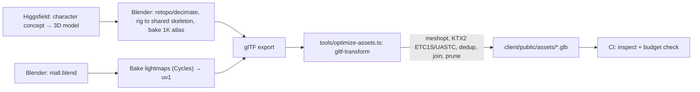

# Art direction & asset pipeline

## Look

**"Evening at a boutique mall."** Warm, calm and premium, not arcade-like.

- **Architecture:** pale travertine floor, warm-white walls, thin brass trims, glass storefronts with slim black mullions, a double-height atrium with a skylight. The reference has the right palette. We add material richness (subtle normal maps, roughness variation) and real light.
- **Light:** baked global illumination. Warm 3000 K downlights in shops, cooler daylight from the skylight, soft contact shadows under benches and planters. Signs have emissive strips and a subtle bloom on High.
- **Reflections:** a polished floor using a prefiltered environment map baked from inside the atrium. Planar reflection on High only.
- **Colour:** each shop brings its own `bg` + `accent`. The mall shell stays neutral so the shops stand out.
- **Characters:** stylised-realistic (like the Higgsfield outputs in the reference) to match the architecture. Every body shares one skeleton.
- **Motion:** eased camera, footstep dust on Medium and above, fountain water with a scrolling normal map, drifting skylight clouds, and 4–6 ambient NPC shoppers (an LOD2 crowd) so an empty mall doesn't feel dead.

## UI

The overlay sits on a busy 3D scene, so it has to be legible and stay out of the way.

| Token | Value |
|---|---|
| `--ink` | `#F6F1E7` |
| `--muted` | `#B9B2A5` |
| `--accent` | `#E2B857` (operators can override it) |
| `--glass` | `rgba(18,17,15,.62)` + `backdrop-filter: blur(14px)` (solid fallback on Low) |
| `--radius` | 999px pills, 20px sheets |
| Font | **Outfit** (variable) + a script-specific Noto font, loaded per locale |

- Dock at the bottom centre (icons with labels on desktop, icons only on phones). Sheets slide in from the right on desktop and up from the bottom on phones.
- Safe-area insets respected. **Nothing overlaps the centre 40 % of the screen** (the reference's emoji rail and prompt overlap on phones).
- Every interactive element is at least 44×44 px on touch.
- Dark only in v1. The 3D scene sets the mood.

## Asset pipeline



### Sources
v1 uses **free CC0 kits** (Kenney, Quaternius, Poly Pizza), recorded per asset in `assets-src/**/LICENSE`. Higgsfield-generated assets follow later as drop-in replacements through the asset library (ADR 0006); the licence has been checked and generated models may be committed.

### Characters
v1 ships the 12 characters of Kenney's **Mini Characters** (CC0), in `assets-src/avatars/kenney-mini-characters/`. `pnpm assets` builds `client/public/assets/avatars/`:

- **`avatars.glb`** (about 180 KB): every character as one skinned mesh (body and head joined, so one draw call each), sharing one 8 KB texture, plus **one** copy of the animation clips. All characters share Kenney's 7-bone rig, so the clips play on any of them. Scaled to 1.55 m. Meshopt-compressed.
- **`<id>.png`**: the 64 px preview used by the character picker.

Clips kept: `idle walk sprint jump fall sit emote-yes emote-no interact-right` (the list is `CLIPS` in `shared/src/avatars.ts`). The source also has wheelchair clips and wheelchairs, walking aids and glasses, which are a natural next addition.

To add or replace characters (for example Higgsfield ones later):
1. Put the `.glb` next to the others. It must use the same 7 joint names (`root torso head arm-left arm-right leg-left leg-right`) so the shared clips fit, or bring its own rig and clips.
2. Add its id to `AVATARS` in `shared/src/avatars.ts` (the server only accepts listed ids) and a 64 px preview.
3. Run `pnpm assets` and commit the output. `tools/test/avatars.test.ts` checks it.

Keep prompts for generated characters in `assets-src/avatars/<pack>/prompt.md`, and record each pack's licence in its folder.

### World
- Units are metres. The concourse is 12 m wide and floors are 7.6 m apart (matching the reference's scale, which feels right).
- Modular kit: storefront (3 widths), column, railing, bench, planter, light fixture, escalator. Repeated kit pieces export as instances.
- Lightmap UV on `uv1`, texel density 32 px/m (concourse) and 16 px/m (upper floor).
- Empties named `slot.<id>`, `seat.<id>`, `spawn.<id>`, `zone.<name>` (with scale = AABB), `esc.<id>.start|end`. `tools/export-meta.py` writes `mall.meta.json`.

### Replacing the building (mall package)
The building is swappable without a deploy: **admin → Building** takes three files and the server does the rest.

| File | What it is |
|---|---|
| Visual model `.glb` | What visitors see. Plain glTF 2.0 for now (meshopt and KTX2 arrive with `optimize-assets.ts`). Max 25 MB. |
| Collision model `.glb` | Simple, uncompressed triangles that people stand on and bump into. Every mesh in the scene counts, with its node transforms. Max 5 MB. |
| `mall.meta.json` | Floors, spawns, shop units, seats, zones and escalators, in the format of `shared/src/meta.ts`. |

On upload the server checks, in order, and refuses the package with the reason if any step fails:
1. The meta matches the schema (errors name the field, e.g. `meta.slots.3.door.yaw`).
2. Every current shop's unit exists in the new meta (move or delete shops first otherwise).
3. The visual model is a valid `.glb`.
4. The navgrid bakes: the collision model isn't absurdly large, every spawn is on walkable floor, and every escalator starts and ends on walkable floor.

The baked navgrid becomes the fourth file of the package. Visitors get the new building on their next visit. Files in use can't be deleted, and **Use the built-in building** switches back. The greybox in `client/public/assets/mall/` is itself a valid package: `pnpm greybox` rebuilds it and `pnpm navgrid` bakes it with the same code the server runs (`shared/src/bake.ts`).

### Props
Furniture and decoration come from a **props pack**, `client/public/assets/props/props.glb` (about 260 KB), built by `pnpm assets` from `assets-src/props/`:

| Kind | Source |
|---|---|
| `bench`, `fountain`, `tree` | Generated with Higgsfield (prompts in `assets-src/props/higgsfield/prompts.md`) |
| `plant`, `bin`, `lamp`, `sofa`, `table`, `chair` | Kenney Furniture Kit (CC0) |
| `shelf`, `shelf-bags`, `register`, `cart`, `fruit` | Kenney Mini Market (CC0), for shop interiors |

`tools/greybox/props.ts` lists each kind's source, real size, facing fix and collision box. The pipeline scales each model to size, stands it on the floor, turns it to face −Z and shrinks textures to 512 px WebP. The mall's meta says where props go (`props: [{ kind, pos, yaw }]`), and the client draws each part of each kind as one `InstancedMesh`. Collision lives in the mall's collision mesh as plain boxes, so props are purely visual and a missing kind is simply skipped.

To restyle the mall's furniture, replace a source file and run `pnpm assets`. The placements and collision don't change. An uploaded building (admin → Building) uses the same pack, placed by its own meta's `props`.

### `optimize-assets.ts` steps
```
dedup → prune → join (per material, static only) → weld → simplify (LOD only)
→ meshopt (encode) → ktx2: ETC1S for albedo/lightmaps, UASTC for normals
→ resize (max 2048 world, 1024 avatars) → write
```

### Asset budgets (enforced in CI)
`tools/test/budgets.test.ts` checks every file under `client/public/assets` against this table and fails with a table of offenders. A file with no matching budget fails too.

| Asset | Tris | Size | Now |
|---|---|---|---|
| Mall visual (one world chunk) | 80k | 1.5 MB | 2.4k tris, 172 KB |
| Collision mesh | 50k | 1.5 MB | 2.2k tris, 91 KB |
| Navgrid | — | 60 KB | 9 KB |
| Avatar pack (all characters and clips) | 15k | 250 KB | 11k tris, 179 KB |
| Props pack | 30k | 300 KB | 12k tris, 262 KB |
| Avatar preview | — | 8 KB | 2 KB |

## Audio
- Ambient loop (soft crowd + fountain, 96 kbps Opus, ~40 s loop, lazy-loaded after the first interaction).
- UI clicks, a door chime when entering a shop, a pop for emoji. Every file is under 20 KB.
- Positional audio for the fountain only. Everything else plays in 2D.
