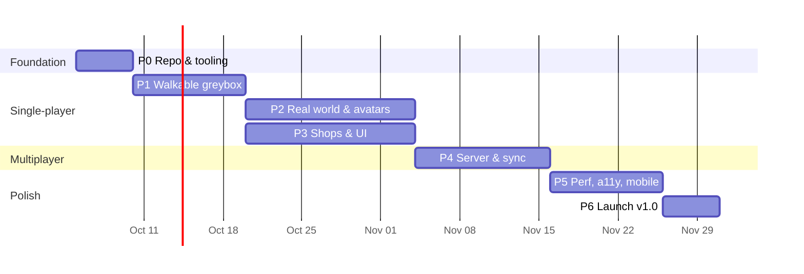

# Roadmap

Each phase ends with something you can demo, and a phase isn't done until its **exit criteria** pass in CI. Task IDs point to [tasks.md](tasks.md).

The dates assume one full-time developer and one part-time 3D artist. Phases 2 and 3 run side by side, one art and one code.

---

## Phase 0: Foundation (week 1)
**Goal:** an empty repo where contributors can't break the build or the budgets.

1. pnpm workspace with `client`, `server` and `shared`, plus TypeScript strict and Biome. (T-001)
2. Vite client that renders a spinning cube with Three.js, plus the `?debug` stats overlay. (T-002, T-003)
3. `shared/config.ts` zod schema and an example `mall.config.ts`. (T-004)
4. CI: typecheck, lint, unit tests, build, size budget. (T-005, T-006)
5. README, CONTRIBUTING, CODE_OF_CONDUCT, issue templates, MIT license. (T-007)

**Exit:** `pnpm i && pnpm dev` works on a clean machine. CI is green. The size check fails when a 300 KB dependency is added.

## Phase 1: Walkable greybox (weeks 2 and 3)
**Goal:** *feel*. Movement and camera have to be good before any art exists.

1. Greybox mall in Blender (boxes only) exported with the meta empties. (T-101)
2. Fixed-step loop, input manager (keyboard, pointer, touch). (T-102, T-103)
3. Capsule controller with the BVH: walls, slopes, steps, two floors, escalators. (T-104, T-105)
4. Third-person camera with collision, zoom and smoothing. (T-106)
5. Mobile joystick and drag-look. (T-107)
6. Navgrid bake + A* + tap-to-walk. (T-108, T-109)
7. Zones and the "You are in" signal. (T-110)

**Exit:** you can walk the whole greybox on desktop and phone at 60 fps, ride an escalator, tap-to-walk to any point, and the camera never clips through walls. A playtest with 3 people says the movement "feels good".

## Phase 2: Real world & avatars (weeks 4 to 6, alongside P3)
**Goal:** *looks*. Swap the greybox for the real mall and real people.

1. Modular kit + mall.blend + lightmap bake. (T-201, T-202)
2. `optimize-assets` pipeline and the asset budget check in CI. (T-203, T-204)
3. Zone chunk streaming and zone visibility. (T-205, T-206)
4. Shared skeleton, animation pack, 2 bodies × 3 outfits via Higgsfield. (T-207, T-208)
5. Avatar factory, animation state machine, accessories. (T-209, T-210)
6. Quality tiers + auto-detect. Floor reflections per tier. (T-211, T-212)
7. Ambient details: fountain, skylight, NPC shoppers. (T-213)

**Exit:** first playable frame within the ≤ 2.5 MB budget. Medium tier runs 60 fps on a Pixel 7a. Screenshots at every tier are approved in design review.

## Phase 3: Shops & UI (weeks 4 to 6, alongside P2)
**Goal:** *purpose*. The mall is actually useful.

1. Preact overlay shell: HUD, dock, toasts, signals bridge. (T-301)
2. Landing screen with live avatar preview, saved look, preloading during the form. (T-302)
3. Signage generator (worker + OffscreenCanvas + IndexedDB cache). (T-303)
4. Shop registry: slots → storefronts, door triggers, the E prompt. (T-304)
5. Shop panel + product adapters (`static`, `json-url`). (T-305, T-306)
6. Directory with fuzzy search. Travel-to (walk or fade-teleport). (T-307)
7. Minimap and overview camera. (T-308, T-309)
8. Deep links `/s/:id` and `/@x,z,yaw`. The static HTML directory page. (T-310, T-311)
9. i18n: English plus one complex-script locale. (T-312)

**Exit:** a new operator can add a shop with products by editing `mall.config.ts` alone, in under 10 minutes (timed with a volunteer). All shop content is reachable without WebGL.

## Phase 4: Multiplayer (weeks 7 and 8)
**Goal:** *together*.

1. `shared/protocol.ts` binary codec with round-trip property tests. (T-401)
2. Server: ws upgrade, sessions, resume, rooms, auto-sharding. (T-402, T-403)
3. Client socket with backoff and resume. Snapshot buffer and interpolation. (T-404, T-405)
4. Remote avatars with LOD, instanced name tags. (T-406)
5. Chat, emotes, batched join/leave, speech bubbles. (T-407, T-408)
6. Moderation: filters, rate limits, mute, report, host token. (T-409, T-410)
7. Docker image and a load-test bot (`tools/bots.ts`). (T-411, T-412)

**Exit:** 100 bots in one room. Clients stay within the network budget. Server CPU is ≤ 10 % of a core. Killing and restarting a client's network for 10 s resumes the session without a join/leave message.

## Phase 5: Performance, accessibility, mobile polish (weeks 9 and 10)
1. `pnpm perf` Playwright budget gate in CI. (T-501)
2. Dynamic resolution, idle throttling, zero allocations per frame. (T-502, T-503)
3. Keyboard/screen-reader audit, reduced motion. (T-504)
4. Phone layout pass: safe areas, nothing blocking the centre, bottom sheets. (T-505)
5. Audio. (T-506)
6. Social verbs: wave, dance, hug, apple. (T-507)

**Exit:** all budgets pass in CI on throttled profiles, axe-core reports no serious issues, and someone has tried every device in the [performance](performance.md) table by hand.

## Phase 6: Launch v1.0 (week 11)
1. Docs site (the `docs/` folder rendered with VitePress) and an operator guide. (T-601)
2. Demo deployment (static + server) and a one-click deploy template. (T-602)
3. Analytics sink example. Privacy note. (T-603)
4. Release checklist, tag, changelog, launch post with a video. (T-604)

**Exit:** the public demo is up, the repo is tagged `v1.0.0`, and a stranger can self-host by following the guide.

---

## Phase 3b: Live content (decided 2026-09-29, before Phase 5)
**Goal:** the mall owner edits shops, products and art from a browser, and changes appear live. See [ADR 0005](adr/0005-railway-postgres-s3.md) and [ADR 0006](adr/0006-live-content-and-swappable-assets.md).

1. Rename the project to **Shopping Mall** (packages, image, docs). (T-700)
2. Postgres schema and migrations; seed from `mall.config.ts`. (T-701)
3. Content API: public read, host-only write; live `content` broadcast. (T-702, T-705)
4. S3-compatible uploads with presigned URLs; asset records by content hash. (T-703)
5. `/admin` page: shops, products, slots, assets. (T-704)
6. Swappable art: the client loads the mall package, avatars and props through asset records. (T-706)
7. Railway deploy with Postgres, a bucket and backups; compose gets Postgres and SeaweedFS. (T-707)

**Exit:** the host adds a shop with a logo and products from `/admin`, and every connected visitor sees the new sign within 2 seconds, with no deploy. Replacing the mall model file swaps the building on the next visit.

## Phase 2 note
3D art for v1 uses **free CC0 kits** (Kenney, Quaternius, Poly Pizza). Higgsfield-generated assets come later, as file swaps (ADR 0006). We checked the licence: generated models may be committed.

## After v1.0 (P2 backlog)
v1.0 shipped on 2026-09-29, with two rounds of improvements the next day (the [changelog](https://github.com/devmtnaing/shopping-mall/blob/main/CHANGELOG.md) has what changed). Since then the live demo simply runs the latest `main`. Still to do from v1: a check on a real Android phone (T-505).

- Private rooms and invite links (the server already takes `?room=`; it needs an "Invite friends" button)
- 3D product pedestals and product `.glb` viewer
- Shopify / WooCommerce adapters
- Scheduled events and host stage
- Proximity voice chat (WebRTC)
- Outfit colour tints (the colour you pick also tints your character's clothes)
- WebGPU renderer by default once it matches WebGL on the device matrix
- Interior theme packs for tenants (mostly covered: interiors follow the shop's category)
- Demo content: fill the live demo's empty units with sample shops, so it doesn't look vacant
- Realistic human characters and props, in place of the stylized ones (see the [plan](plans/realistic-characters.md))
