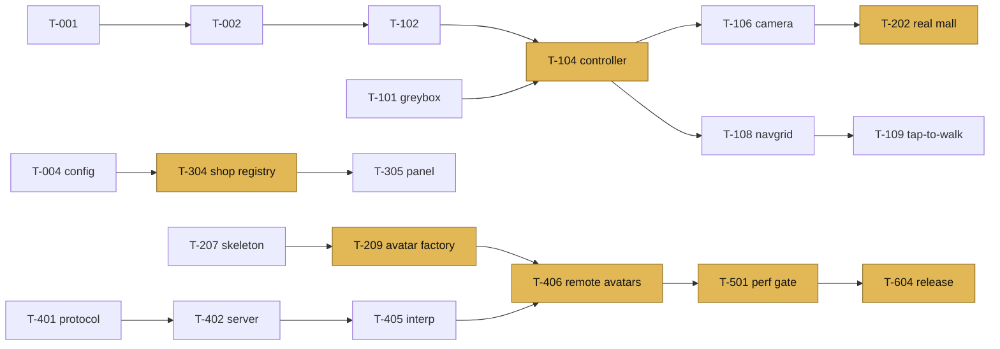

# Engineering tasks

Ticket-sized work items grouped by [roadmap](roadmap.md) phase. Each one is meant to become a GitHub issue.

**Size:** S ≤ ½ day · M ≤ 2 days · L ≤ 4 days. Anything bigger gets split.
**Labels:** `client` `server` `shared` `art` `tooling` `ui` `perf` `a11y` `good first issue`

Every task also has an implicit acceptance criterion: *typecheck, lint, tests and budgets pass, and no file is over ~300 lines.*

**Progress:** Phase 0 ✅ (T-001 to T-007) · Phase 1 ✅ (T-101 to T-110) · Phase 3 ✅ (T-301 to T-312) · Phase 4 ✅ (T-401 to T-412) · Phase 3b (live content) added 2026-09-29, next up. Changes from the plan are noted in the rows.
Phase 4 load test (laptop, 100 bots in one room): 6.5 KB/s down per client, server 3.7 % of a core, 1.9 ms per tick.
T-101 deviated from the plan: with no Blender on hand, the greybox is generated from [`tools/greybox/layout.ts`](../tools/greybox/layout.ts) and writes the same files a Blender export will ([greybox.md](greybox.md)).
T-104 uses a "floating capsule" (body capsule from step height up, with ground rays below) instead of a full capsule, because rounded capsules can't climb steps without hacks.

---

## Phase 0: Foundation

| ID | Task | Size | Labels | Acceptance criteria |
|---|---|---|---|---|
| T-001 | pnpm workspace (`client`, `server`, `shared`), TS strict, Biome, path aliases | S | tooling | `pnpm i && pnpm -r typecheck` passes. `shared` is importable from both client and server |
| T-002 | Vite client boots Three.js: renderer, resize, one rAF loop, spinning cube | S | client | Canvas fills the viewport. DPR is capped. No console errors |
| T-003 | `?debug` overlay: fps, frame-time graph, `renderer.info`, heap | S | client perf `good first issue` | Overlay toggles with the query param. Costs < 0.2 ms/frame |
| T-004 | `shared/config.ts` zod schema + example `plaza.config.ts` with 6 shops | M | shared | An invalid config fails at build time with a readable error path |
| T-005 | GitHub Actions: typecheck, lint, vitest, build | S | tooling | Runs on PRs in < 3 min with a pnpm cache |
| T-006 | `pnpm size` against `budgets.json` | S | tooling perf | Fails when the initial JS is over 220 KB gz. Prints a table |
| T-007 | Community files: CONTRIBUTING, CoC, issue/PR templates, LICENSE | S | tooling `good first issue` | GitHub's community profile shows 100 % |

## Phase 1: Walkable greybox

| ID | Task | Size | Labels | Acceptance criteria |
|---|---|---|---|---|
| T-101 | Greybox `mall.blend`: 2 floors, atrium, 12 slots, 2 escalators, empties per the naming spec. Export script for `mall.meta.json` | M | art tooling | Meta JSON validates against the schema. Slots, seats and spawns load in the client as debug gizmos |
| T-102 | `loop.ts`: fixed 60 Hz step + render interpolation. Pause when the tab is hidden | S | client | Movement speed is identical at 30, 60 and 144 fps (unit test with fake time) |
| T-103 | `input.ts`: keyboard, pointer lock, drag-look, wheel/pinch zoom, focus-safe (typing in chat never moves the player) | M | client | Unit tests for key state. Ctrl+W is never swallowed |
| T-104 | Capsule controller vs. `three-mesh-bvh`: slide on walls, step up ≤ 0.35 m, slopes ≤ 40°, gravity, jump | L | client | Automated test walks a scripted path through the greybox with no tunnelling. Recovers if spawned inside geometry |
| T-105 | Escalators: a moving surface along `esc.*` paths, carries the player, works in both directions | M | client | Riding up and down lands on the correct floor. No jitter at the ends |
| T-106 | Third-person camera: spring follow, collision (spherecast), zoom 2–9 m, shoulder offset, auto-recenter while moving | M | client | Never clips through walls in the greybox (test sweeps 360° at 20 spots) |
| T-107 | Touch controls: joystick (left half, dynamic origin), drag-look (right half), action buttons | M | client ui | Works with two fingers at once. 44 px minimum targets |
| T-108 | `tools/bake-navgrid.ts`: collision mesh → 0.25 m walkable grid per floor + escalator links → `navgrid.bin` | M | tooling | Grid ≤ 60 KB. The debug view shows the grid overlay |
| T-109 | A* + path smoothing (string-pulling) + tap/click-to-walk. Tapping a shop targets its door | M | client | Path to any reachable cell in < 2 ms. Cancelled by any movement input |
| T-110 | Zones: AABB lookup → `zone` signal, with hysteresis | S | client `good first issue` | The label updates once when you cross a boundary, not repeatedly |

## Phase 2: Real world & avatars

| ID | Task | Size | Labels | Acceptance criteria |
|---|---|---|---|---|
| T-201 | Modular kit: storefront ×3 widths, column, rail, bench, planter, light, escalator | L | art | Every piece within the asset budgets. Pivot and naming conventions followed |
| T-202 | Final `mall.blend` + Cycles lightmap bake to `uv1` per zone chunk | L | art | No seams or light leaks visible at Medium. Bake script is reproducible |
| T-203 | `tools/optimize-assets.ts` (gltf-transform: dedup, prune, join, meshopt, KTX2, resize) | M | tooling | One command processes every file in `assets-src/`. Deterministic output |
| T-204 | Asset budget CI: `gltf-transform inspect` on changed `.glb` files | S | tooling perf | Fails the PR with a table when over budget |
| T-205 | Zone chunk streaming: load within 25 m or on panel open, LRU unload, dispose GPU resources | M | client perf | Memory stays flat after walking the mall 5 times (heap + `renderer.info`) |
| T-206 | Baked zone-to-zone visibility → hide non-visible chunks | S | client perf | Draw calls drop ≥ 30 % in the concourse versus no culling |
| T-207 | Shared skeleton + `anims.glb` (13 clips, retargeted, root motion removed) | M | art | ≤ 200 KB. Every clip plays on both body types without foot sliding at nominal speed |
| T-208 | Higgsfield → Blender: 2 bodies × 3 outfits with LOD0/1/2 on one atlas each, plus 6 hats and 2 glasses | L | art | Each outfit ≤ 400 KB. Prompts and licenses committed |
| T-209 | Avatar factory: body + outfit + accessories → one `Object3D`. Shares clips and materials | M | client | Creating a 2nd avatar with the same outfit downloads nothing and allocates no new textures |
| T-210 | Animation state machine: idle / walk / run / jump / fall / land / sit, speed-matched blend, crossfades | M | client | No pops between states. Walk cycle speed matches movement speed |
| T-211 | Quality tiers + auto-detect (GPU probe + 3 s frame-time sample), saved | M | client perf | Low, Medium and High apply the settings table in the architecture doc. Changes live without reloading |
| T-212 | Floor reflections per tier (env-map / blurred / planar half-res) | M | client perf | High costs ≤ 3 ms on an M1. Low has zero extra passes |
| T-213 | Ambient life: fountain shader, skylight clouds, 4–6 NPC shoppers wandering the navgrid at LOD2 | M | client art | Total cost ≤ 1 ms/frame on Medium |

## Phase 3: Shops & UI

| ID | Task | Size | Labels | Acceptance criteria |
|---|---|---|---|---|
| T-301 | Preact overlay shell, `state.ts` signals, command bus, dock, toasts | M | ui | No component re-renders during steady walking (Preact devtools) |
| T-302 | Landing screen: name, body, outfit, accessories, live preview, online count. Preloads the world during the form | M | ui client | Enter → first playable ≤ 1 s on broadband when the preload is already done. Look is saved |
| T-303 | Signage generator: canvas painting, text fitting, complex-script shaping, per-script fonts loaded on demand | M | client | Burmese and Latin signs render correctly. ≤ 5 ms per sign. *(Changed from worker + IndexedDB: web fonts don't reach workers without extra loading code, and painting ~3 ms/sign is cheaper than a cache round-trip.)* |
| T-304 | Shop registry: config → slot storefronts (sign, window, door trigger), E / tap prompt | M | client | Moving a shop to another slot in config moves it in the world. No Blender change needed |
| T-305 | Shop panel (desktop sheet / mobile bottom sheet): details, features, products, CTAs, focus trap | M | ui a11y | Opens < 100 ms. Esc closes and returns focus. Works with no WebGL |
| T-306 | Product adapters: `static`, `json-url`. Cache (memory 5 min + last good copy in localStorage). Error state | M | client shared | Adapter failure shows an honest message, never fake products. Unit tests with mocked fetch. *(localStorage instead of IndexedDB: product lists are small, and it's far less code.)* |
| T-307 | Directory: categories, fuzzy search (multi-language), travel (walk < 40 m, else fade-teleport) | M | ui client | `/` opens it. Keyboard-only use works. Reduced motion → instant |
| T-308 | Minimap: SVG from meta (slots, you, friends), click to travel, floor switch | S | ui `good first issue` | Updates at ≤ 10 Hz. No layout thrash |
| T-309 | Overview camera (M): animated top-down view, tap to travel | S | client | Transition ≤ 800 ms, skipped with reduced motion |
| T-310 | Deep links `?s=<shop>` and `?at=x,z,yaw,floor`, plus Share buttons | S | client | Opening a link spawns you there with the panel open. Unknown id → toast + default spawn. *(Query parameters instead of `/s/:id` paths: they work on any static host with no rewrite rules.)* |
| T-311 | Static HTML directory (`/directory`) generated at build from config: shops, links, products | S | tooling a11y | Lighthouse SEO ≥ 95. Fully usable with JS disabled |
| T-312 | i18n: string tables, locale switcher, per-locale font loading, `Intl.NumberFormat` prices | M | ui | Switching locale re-renders UI and signs without a reload |

## Phase 4: Multiplayer

| ID | Task | Size | Labels | Acceptance criteria |
|---|---|---|---|---|
| T-401 | `shared/protocol.ts`: message ids, INPUT/SNAPSHOT binary codec, JSON event types | M | shared | Property test: encode→decode round-trips within quantisation error. 11 bytes/player |
| T-402 | Server core: HTTP health, ws upgrade, JOIN/WELCOME, 15 Hz tick, snapshot broadcast | M | server | 1 client sees another move. `GET /health` → 200 with room counts |
| T-403 | Sessions: resume tokens (30 s grace), rooms of 100, auto-shard `main-N`, interest by zone (≤ 40 nearest) | M | server | Reconnecting within 30 s produces no join/leave. The 101st player lands in `main-2` |
| T-404 | Client socket: backoff 0.5→8 s, resume, offline banner, falls back to single-player | S | client net | Network kill for 10 s → resumes silently. Server down → the mall still works alone |
| T-405 | Snapshot ring buffer + interpolation at −100 ms, extrapolation ≤ 250 ms | M | client net | Smooth motion at 10 % packet loss (simulated) |
| T-406 | Remote avatars: pool, LOD tiers, animation throttle, instanced name tags with distance fade | M | client perf | 100 remote players: ≤ 16 ms/frame on Medium with 40 visible. *(Done for placeholder capsules: one instanced draw for all bodies and one for all tags. LOD tiers and animation throttling move to T-209/T-210, once there are real skinned avatars to throttle.)* |
| T-407 | Chat: panel, global channel, rate limits, 200 chars, safe rendering, join/leave batched every 2 s | M | client server ui | No `innerHTML` with user text (lint rule). Batching verified by test |
| T-408 | Emotes + speech bubbles above avatars (5 s) | S | client | Visible only to the interest set |
| T-409 | Moderation: name/chat filter (pluggable word list), per-user mute (client), report → server log/webhook | M | server ui | Muted user's chat and bubbles hidden. The report includes the last 20 messages |
| T-410 | Host role: `HOST_SECRET` → `/host-token` JWT (12 h), gold tag, "Host is here" on the landing page, announcements | S | server client | The token is never stored in `localStorage`. An invalid token is rejected with a clear error |
| T-411 | Dockerfile (distroless) + `docker-compose.yml` with the static site | S | tooling | `docker compose up` → working multiplayer mall on :8080. *(Server image is ~160 MB: the Node 24 runtime in the distroless base is almost all of it, so the original < 80 MB target was unrealistic. The web image is ~50 MB.)* |
| T-412 | `tools/bots.ts`: N headless bots walking navgrid paths and chatting | S | tooling server | 100 bots run from one laptop. Server metrics are logged |

## Phase 3b: Live content

| ID | Task | Size | Labels | Acceptance criteria |
|---|---|---|---|---|
| T-700 | Rename Plaza → Shopping Mall: packages, Docker images, docs, demo mall name | S | tooling | No "Plaza" left except history. CI green |
| T-701 | Postgres schema + migrations (mall, shops, products, assets); seed from `plaza.config.ts` on an empty database | M | server shared | `pnpm db:migrate` is idempotent. Seeding twice creates nothing new. Tests run against a real Postgres (CI service) |
| T-702 | Content API: `GET /api/content` (public, cached by version), host-only writes for mall, shops and products, with shared zod validation | M | server shared | Writes without a host token get 401. Invalid data gets 400 with field paths. Content version bumps on every write |
| T-703 | Uploads: presigned PUT to S3-compatible storage, asset records keyed by content hash, size and type limits | M | server | A 5 MB PNG uploads directly to the bucket. Duplicates dedupe by hash. Works with MinIO locally and Railway buckets |
| T-704 | `/admin` page (host only): list, add, edit, delete and reorder shops, products, slot assignment, and the asset library | L | ui | A new shop with a logo and 3 products takes under 2 minutes. Keyboard accessible. Confirms before deleting |
| T-705 | Live updates: server broadcasts `content` version, clients refetch and repaint signs, panels, directory and zones | M | client server | A change in /admin shows on another visitor's screen within 2 s, without a reload |
| T-706 | Swappable art: mall package (model + collision + meta + navgrid), avatars and props loaded via asset records. Upload validates the meta schema and bakes the navgrid | L | client server tooling | Replacing the mall model in /admin swaps the building on the next visit. A bad package is rejected with a clear error |
| T-707 | Railway deploy: server + Postgres + bucket, env docs, daily `pg_dump` to the bucket. compose gains Postgres + MinIO | M | tooling | A deploy from `main` works end to end. Restoring a backup is documented and tested once |

## Phase 5: Performance, accessibility, mobile

| ID | Task | Size | Labels | Acceptance criteria |
|---|---|---|---|---|
| T-501 | `pnpm perf` Playwright gate (Fast 4G, 4× CPU): time to playable, frame times, draw calls, heap → PR comment | M | tooling perf | Fails the PR when any budget in `performance.md` is exceeded |
| T-502 | Dynamic resolution (0.75–1.0) + idle 30 fps + hidden-tab pause | S | client perf | p90 frame time stays under budget on the Low device |
| T-503 | Zero-allocation audit: scratch pools, preallocated buffers | M | client perf | Chrome allocation timeline shows ~0 B/frame while walking |
| T-504 | a11y audit: axe-core in e2e, focus order, labels, reduced motion, live-region chat | M | a11y | 0 serious or critical axe issues. The whole directory → shop → link flow works with a screen reader |
| T-505 | Phone layout pass: safe areas, centre kept clear, sheets, landscape | M | ui | Verified on iOS Safari + Android Chrome. Screenshots in the PR |
| T-506 | Audio: ambient loop, UI SFX, door chime, positional fountain, volume settings | S | client | Nothing plays before the first interaction. Total ≤ 250 KB |
| T-507 | Social verbs: wave, dance, hug (two-player sync), apple pick/throw (arc, client-side) | M | client server | Hug aligns both avatars. Everything is rate-limited |

## Phase 6: Launch

| ID | Task | Size | Labels | Acceptance criteria |
|---|---|---|---|---|
| T-601 | VitePress docs site: operator guide (config, adding shops, adapters, self-hosting), contributor guide | M | tooling | A volunteer self-hosts from the docs without help |
| T-602 | Demo deploy + one-click deploy template (static host + container host) | S | tooling | Demo URL in the README. Deploy button works |
| T-603 | Analytics sink example (beacon → JSON logs) + privacy note | S | client | No cookies, no personal data. Events documented |
| T-604 | Release: changelog, `v1.0.0` tag, 60 s demo video, launch post | S | tooling | Release published on GitHub |

---

## Dependency graph (critical path highlighted)

