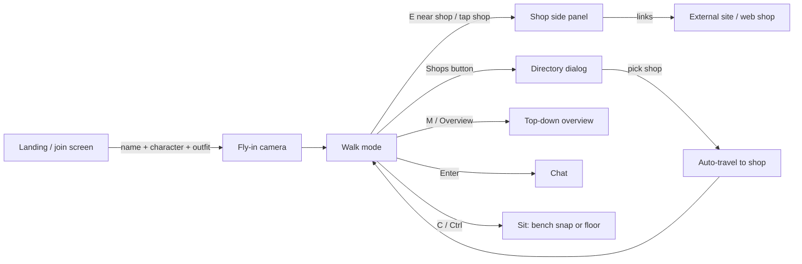

# Teardown: NC Mall (reference)

Explored as a guest on **2026-09-28** at <https://punchkonay.tech/mall/>. Desktop Chromium at 1200×1223, DPR 1, plus a 390×844 viewport check. The numbers below come from the browser's network and performance APIs during that session.

## 1. What it is

A multiplayer third-person 3D mall. You pick a name and a character, walk the concourse, open shop panels, sit on benches, send emoji, throw apples, hug people and chat. The shops are mostly the creator's own properties: YouTube channels, a community, a bootcamp, a web shop and an arcade. There's also a "Your Brand Here" space for rent.

The site credits Higgsfield for the character models and Claude Opus for building it.

## 2. User flow

### Join screen
- Name field. Two body types (male/female) with 3 outfits each ("Pro Gamer", "Street Casual", "Smart Night"; "Seoul Casual", "Campus Cute", "Street Pop").
- 7 hats (none, cap, beanie, bucket, beret, cat ears, crown) and 3 glasses options (none, round, sunglasses).
- A live 3D preview of your character turns slowly on the right, in front of a large window. It looks good.
- A live "N people in the mall now" counter, plus a "Host login" link that uses a password.

### In the mall
- **HUD:** brand pill top-left, "You are in: *Zone*" top-centre, online count and fullscreen top-right, a chat log bottom-left, a dock at the bottom (Walk · Overview · Chat · Shops · Games · Help), an emoji rail on the right, and a clickable minimap bottom-right.
- **Controls (desktop):** WASD, Shift to run, Space to jump, C/Ctrl to sit, 1–6 for emoji, F for apple, G for hug, Enter/T to chat, E to visit, M for overview, scroll to zoom. Click once to lock the mouse and steer with it.
- **Controls (phone):** joystick, Run/Sit/Jump buttons, drag to look, pinch to zoom, tap a shop to open it.
- **World:** two floors (ground and +7.6 m), two escalators, a central atrium with a fountain, a round NC sign, planters, benches, massage chairs and hostess standees. Ten shops sit along the sides with a flagship store at the far end. Upstairs has rooms for rent. The floor shows mirror-like reflections of the signs.
- **Shop panel:** a right-hand sheet with eyebrow, title, tagline, description, feature bullets, a product grid (each product linked to `/shop/product.php?id=N`) and CTA buttons. Products are also painted in 3D on a board inside the store, and the prices are real text.
- **Directory:** a "Where do you want to go?" dialog grouped by left and right side. Picking a shop moves you there.
- **Sitting:** snaps you to the nearest bench, armchair or massage chair (the massage chair plays a 😌 emote). Otherwise you sit on the floor.

## 3. How it's built

| File | Size | Lines | Role |
|---|---:|---:|---|
| `app.js` | 52 KB | 833 | Join screen, controls, camera, networking, chat, HUD, panels. One large module |
| `world.js` | 36 KB | 552 | Builds the whole mall from code (boxes, transforms) |
| `avatars.js` | 27 KB | 398 | Character parts, walk/run/sit posing, emoji |
| `textures.js` | 26 KB | 390 | Draws every sign, screen and poster onto `<canvas>` atlases |
| `style.css` | 22 KB | 260 | UI styling |
| `engine.js` | 20 KB | 345 | Hand-written WebGL2 renderer: math, geometry builders, one lit shader |
| `glb.js` | 13 KB | 212 | Minimal glTF 2.0 loader with skinning |
| `mallplus.js` | 12 KB | 174 | Second floor, escalators, seats, floor-height logic |
| `shops.js` | 11 KB | 182 | Content config: mall, flagship, shops, outfits |

- **No libraries and no build step.** The files are plain ES modules served unminified. Some requests carry a cache-buster (`style.css?v=11`, `app.js?v=11`) and others don't (`engine.js`, `world.js`, …). After a deploy, returning users can end up with a mix of old and new modules.
- **Geometry is procedural.** The mall is built from code, not modelled. That keeps downloads tiny, but the design is hard to change without programming, and the result looks boxy up close.
- **Canvas-drawn signage.** Every sign, price and poster is rendered from data, so it supports Burmese text and changes when the config changes. **Worth copying.**
- **Assets:** `konay.glb` (host model, 2.6 MB, 31,312 triangles, 1 material, 24 bones) and `avatars/m1.glb` (2.4 MB). Both are fetched on the **landing page**, before the user enters, and the host model loads even when the host isn't online.
- **Networking:** `api.php` over HTTP POST.
  - `?a=join` returns a session and token. After that, `?a=sync` runs every **~790 ms (median)**, each call taking ~93 ms with ~355 B responses.
  - Chat (`?a=chat`) and actions (`?a=act`) are separate POSTs.
  - Requests abort after 6 s. During my session **several syncs aborted in a row (`ERR_ABORTED`), then the server returned `410`, and the client silently re-joined.** Each re-join posted another "joined the mall" line in chat, which is why the log is full of "abc joined / abc left".
  - Player state is bit-packed into one integer (`sit | air<<2 | speed<<3`). That's a smart, compact design worth keeping.
  - Remote players "glide toward their latest position", but with ~1.25 updates/s their motion looks visibly laggy.
- **Products** come from `/api/products.php`. It returned **404** during my visit, so the panel fell back to 6 demo products with SVG images.
- **Host auth:** the host password can be saved in `localStorage` ("remember"). Anything with script access to the origin can read it.

## 4. Measurements

| Metric | Value |
|---|---|
| Frame rate (desktop, Apple silicon, DPR 1) | ~144 fps, capped by display |
| JS heap after ~2 min | ~37 MB |
| Sync cadence / payload | ~790 ms / ~355 B |
| Model downloads before entering | ~5.1 MB (two uncompressed GLBs) |
| Console errors | products API 404; aborted syncs |

I didn't test on a real phone. The 390 px viewport check showed the emoji rail covering part of the scene and the prompt pill overlapping the zone label.

## 5. Keep / fix / add

### Keep
- The single-file content config (`shops.js`). Non-developers can edit it.
- Canvas-generated, localised signage and product boards.
- The join screen with a live 3D preview and simple wardrobe choices.
- The directory, minimap-to-travel and the "You are in *Zone*" label. Navigation is clear.
- Bench-snapping sit, emoji and playful social verbs (apple, hug).
- Bit-packed player state.
- A dark UI with gold accents and pill-shaped buttons. It reads well over a busy 3D scene.

### Fix
| Problem | Plaza's answer |
|---|---|
| ~1.25 Hz HTTP polling, aborts, 410 → silent re-join, chat spam | WebSocket, 15 Hz binary snapshots, 100 ms interpolation buffer, resume tokens, collapsed join/leave notices |
| 5 MB of uncompressed GLB fetched on the landing page | Meshopt + KTX2, shared skeleton/animations, load the host model only when the host is online, stream the world by zone |
| One 833-line `app.js` | Small modules with one job each (see [architecture](architecture.md)) |
| Procedural boxes limit the art | Blender-authored world with baked lightmaps. Signage stays data-driven |
| Mixed cache-busting | Vite build with content-hashed filenames |
| Password in `localStorage` | Host role through a signed, short-lived token issued by the server |
| No deep links | `/s/:shopId` routes, shareable positions, an HTML directory crawlers can read |
| Brittle product feed (404 → demo) | Typed product adapters with caching and a visible "offline" state |

### Add
- Tap-to-walk and click-to-walk with pathfinding (better for phones and for people who don't play games).
- Quality tiers with automatic detection. Reduced motion. A full keyboard/screen-reader path through the directory.
- Proximity chat bubbles above avatars, plus mute/report.
- Shop "moments": animated window displays, in-store product pedestals you can inspect in 3D.
- A visitor analytics hook (anonymous: zone dwell time, shop opens, outbound clicks) so shop owners can see value.
